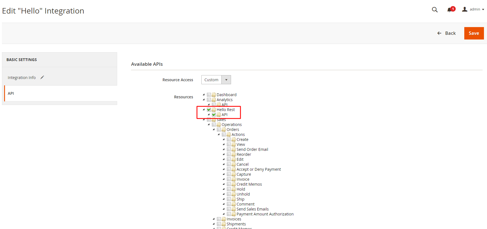

http://localhost/learning/php/magento/rest/V1/habib/admin

## Create a module and API with phpStrom
```
    1. Click right button on code folder then go to new and find the magento module
    2. Create Api directory and create an interface with following code:
        interface HelloInterface
        {
            /**
             * @return string
             */
            public function hello();
        
            /**
             * @return string
             */
            public function world();
        
        }
    3. Create a Model directory and create a php class which will implements the interface just created as follows:
        class Hello implements HelloInterface
        {
           /**
             * @return string
             */
            public function hello()
            {
                return 'Hello get method';
            }
        
            /**
             * @return string
             */
            public function world()
            {
                return 'Hello ';
            }
        }
        
    4. Create module.xml and follow the following code
        <?xml version="1.0"?>
        <config xmlns:xsi="http://www.w3.org/2001/XMLSchema-instance"
                xsi:noNamespaceSchemaLocation="urn:magento:framework:Module/etc/module.xsd">
            <module name="Habib_Hello"/>
        </config>
    5. Create etc folder and create di.xml file and follow the following code :
    
        <?xml version="1.0" ?>
        <config xmlns:xsi="http://www.w3.org/2001/XMLSchema-instance" xsi:noNamespaceSchemaLocation="urn:magento:framework:ObjectManager/etc/config.xsd">
            <preference for="Habib\Hello\Api\HelloInterface" type="Habib\Hello\Model\Hello" />
        </config>
    6. Create webapi.xml file and follow the following code:
        <?xml version="1.0"?>
        <routes xmlns:xsi="http://www.w3.org/2001/XMLSchema-instance"
                xsi:noNamespaceSchemaLocation="urn:magento:module:Magento_Webapi:etc/webapi.xsd">
        
            <route url="/V1/habib/hello" method="GET">
                <service class="Habib\Hello\Api\HelloInterface" method="hello"/>
                <resources>
                    <resource ref="anonymous" />
                </resources>
            </route>
        
            <route url="/V1/habib/admin" method="POST">
                <service class="Habib\Hello\Api\HelloInterface" method="world"/>
                <resources>
                    <resource ref="Habib_Hello::rest_api" />
                </resources>
            </route>
        
            <route url="/V1/habib/customer" method="POST">
                <service class="Habib\Hello\Api\HelloInterface" method="world"/>
                <resources>
                    <resource ref="self" />
                </resources>
            </route>   
        </routes>   
    7. Run  
        - php bin/magento setup:upgrade
        - php bin/magento cache:clean
        - php bin/magento cache:clean config_webservice
        
    8. Go to postman and hit 1st method which is no security "<resource ref="anonymous" />"
        - http://localhost/learning/php/magento/rest/V1/habib/hello
            (baseurl + rest/default + endpoint)
            
    9. Go to magento admin palen and system then integration and create 
```

```
    NOTE: Code can be followed from vendor\magento\module-catalog
      
```
